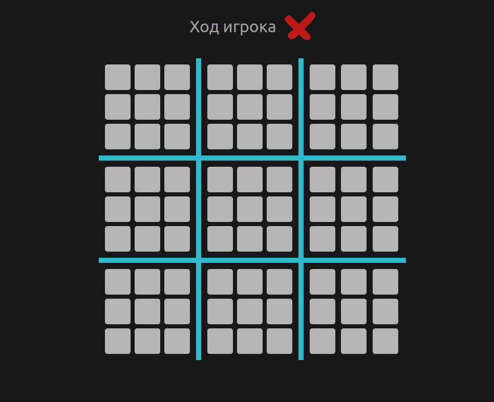

# Ultimate Tic Tac Toe

## Инструкции по запуску проекта

1. Убедитесь, что у вас установлен Node.js на вашем компьютере.
2. Клонируйте этот репозиторий на ваш компьютер `git clone https://github.com/MrRouOne/ultimate-tic-tac-toe`.
3. Перейдите в директорию проекта в вашем терминале.
4. Запустите `npm install` для установки зависимостей.
5. Запустите `npm run dev` для запуска сервера разработки.
6. Перейдите по адресу, который отобразился в терминале.

## Правила игры

1. Игра происходит на девяти малых досках.
2. Игроки ходят поочередно, ставя свой символ (X или O) в любую свободную клетку на малых досках.
3. Каждый ход определяет, на какой малой доске должен сделать свой ход следующий игрок.
4. Цель игры - выстроить три своих символа в ряд, столбец или по диагонали на любой из малых досок.
5. Если ход игрока направляет противника на завершенную доску или доску с победителем, противник может выбрать
   любую доступную доску для следующего хода.
6. Игра продолжается до тех пор, пока один из игроков не выиграет на большой доске или пока все клетки не будут
   заполнены без победителя, что приводит к ничьей.

